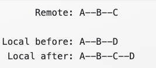

## Console Commands

Using your terminal to talk to Git and get information about how your local R project is interacting with your remote Github repo. Here are some codes I end up using in command line:

-   Stage commits and push changes to Github:

    -   git add \<FILENAME\>

    -   git commit -m"\<INSERT MESSAGE\>"

    -   git push

-   Unstage a commit (same as un-checking a changed file)

    -   git reset –- \<FILENAME\>

-   Remove a previously tracked file

    -   git rm \<FILENAME\>

-   Check the status of files (you can also do this by viewing the status column under the "Git" tab)

    -   git status

    -   git log

-   Check out what has changed in your files

    -   git diff

-   Pull remote changes into local repo

    -   git pull

    -   git pull –-ff-only (fast forward only is often the default and this means that git will only pull files that have no merge conflicts with your local repo)

    -   But oops you have work on your computer & don't want to overwrite it! Often you will notice when you go to push your changes & you get an error that say something about the main being ahead of the origin (your remote repo). Here's a [helpful explainer for tricky pulls](https://happygitwithr.com/pull-tricky)! The take home commands are:

        -   Store changes elsewhere temporarily & then replace them after pull

            -   git stash save

            -   git pull

            -   git stash pop

        -   BUT this won't work if you are have a conflict with the new files

            -   git reset (reset the git process)

            -   git stash drop

        -   One option: Fetch and merge will send you to a merge conflict editor to manual resolve conflicts. Probably most robust option.

            -   git pull

        -   Another option: Pull and rebase which is smoother at first, but might get complicated later.

            -   git pull –-rebase

            

            -   Use git rebase –-abort if you are experiencing a lot of merge conflicts still!
